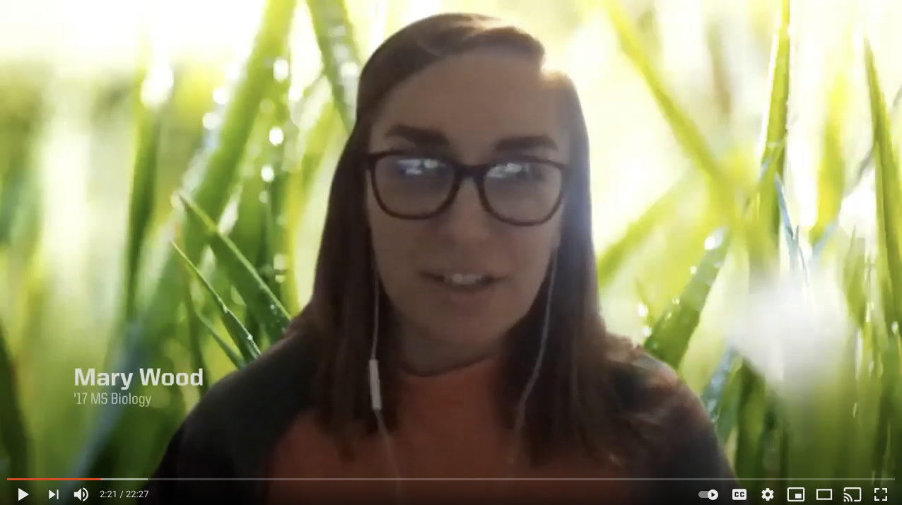

As part of the grand opening of University of Oregon's Phil and Penny Knight Campus for Accelerating Scientific Impact in 2020, I participated in a virtual panel discussion on academic programming. I shared what my experience was like while pursuing my M.S. in the Bioinformatics and Genomics track of the Graduate Internship Program. Click the thumbnail below to watch the video on YouTube!

I've also acted as an alumni mentor to three students in the Bioinformatics and Genomics track during the 2021-2022, 2022-2023, and 2024-2025 school years, meeting monthly to discuss their experience in the Master's program and provide support and guidance based on my own experience.

In 2022 and 2023, I volunteered with [Women in Science Portland](https://www.womeninsciencepdx.org/), supporting their Fundraising committee with data analysis work to guide planning and goal setting, as well as their Professional Development committee to assist with the execution of networking events. In Summer 2022, I led a 6 week, virtual "Community Cohort" group on Data Visualization, bringing members of the WISPDX community together to discuss articles on visualization strategies and help one another improve our figures. I also helped launch the organization's Community Slack in 2023 to provide another virtual space for women in science to connect.

From 2021-2023, I volunteered with the Multnomah County District Attorney's Office as a Sexual Assault Victim Advocate, where I provided on-call advocacy to victims of sexual assault during their forensic exams and law enforcement interviews, connecting them to resources and offering emotional support.
